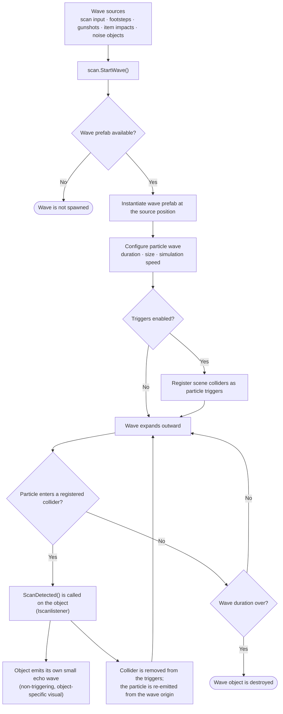

# Echoes of the Blind

Echoes of the Blind is a first-person Unity game built around a single idea: you cannot see the world, you can only hear it. Every sound — a scan pulse, a footstep, a gunshot, a falling object — sends out a visible wave that briefly reveals whatever it touches. The game combines this scan mechanic with enemy encounters, interactable items, and mission objectives.

A playable build and the project page are available at https://zyell0w.itch.io/echoes-of-the-blind. The project is currently in development.

## Unity Version

Unity `6000.3.0f1`

## Setup

1. Install Unity `6000.3.0f1` (or a compatible 6000.3 version) through Unity Hub.
2. In Unity Hub, choose **Add project from disk** and select the `Echoes-of-the-Blind` folder.
3. Open the project and let the Package Manager restore dependencies.

No additional setup is required.

## Dependencies

The project uses the following Unity packages:

| Package | Version | Purpose |
| --- | --- | --- |
| Input System | `1.16.0` | Player and UI input across keyboard, mouse, and gamepad |
| Universal Render Pipeline | `17.3.0` | Rendering |
| Shader Graph | `17.3.0` | Shader authoring for the scan wave visuals |
| AI Navigation | `2.0.10` | NavMesh-based enemy movement |
| Unity UI (uGUI) | `2.0.0` | Menus and in-game UI |
| Unity Ads / Analytics / Purchasing | `4.16.4` / `3.8.2` / `5.4.1` | Monetization and analytics services |

## Project Structure

- `Assets/Scenes` — entry and gameplay scenes with lighting and NavMesh data
- `Assets/Scripts/Player` — movement, camera look, input handling, interaction, and item use
- `Assets/Scripts/Scan` — the scan wave system (see below)
- `Assets/Scripts/Enemy` — enemy behavior
- `Assets/Scripts/Items` — weapons, traps, and other interactable or equipable objects
- `Assets/Scripts/Missions` — mission controller and objective objects (doors, windows, TV, noise maker, incense)
- `Assets/Scripts/Menu` — entry menu, settings, and dialogue
- `Assets/Prefabs` — player, enemy, item, mission, and wave prefabs
- `Assets/Resources` — fonts, images, models, and dialogue data
- `Assets/Settings` — URP pipeline and quality assets

## Running the Project

Open `Assets/Scenes/entry.unity` and enter Play Mode. The entry scene leads into the main gameplay scene (`Assets/Scenes/MainScene.unity`), which can also be opened directly when working on gameplay.

## Controls

| Action | Binding |
| --- | --- |
| Move | `WASD` |
| Look | Mouse |
| Attack | Left mouse button |
| Interact | `E` |
| Scan | `Space` |
| Walk | `Left Shift` |
| Crouch | `C` |
| Previous / next item | `1` / `2` |
| Drop item | `Q` |
| Menu | `Escape` |

## Scan System

The scan system is the core mechanic of the game. The world is revealed through expanding particle waves: the player emits a pulse, and anything the wave touches answers with its own smaller echo wave.

Waves can start from many sources — the scan input, footsteps, gunshots, item impacts, and noise-making mission objects such as the TV or the noise maker. Every source goes through `scan.StartWave()`, which spawns a wave prefab and registers scene colliders as particle triggers. When a wave particle reaches a registered collider, `scandetector` notifies the hit object through the `Iscanlistener` interface. Each collider reacts only once per wave: after the hit it is removed from the trigger list and the particle is re-emitted from the wave origin.

<b>📡 Wave Mechanic Flowchart</b>

 

The player, enemies, items, and mission objects all implement `Iscanlistener`, so each of them reacts to an incoming wave in its own way.

## Development Notes

- Player movement uses a `CharacterController` with camera look, interaction raycasts, and item handling.
- Footsteps trigger smaller scan waves, so moving fast makes the player more visible — and more audible.
- Interactable and equipable objects share common interfaces (`IInteractable`, `IEquipable`).
- Mission objectives are built as individual objects (entry door, windows, ammo box, TV, noise maker, incense) coordinated by a mission controller.
- Dialogue data is stored under `Assets/Resources`.

## Build Notes

The build scene order is `entry.unity` followed by `MainScene.unity`. Open **File > Build Profiles**, confirm the scene order, select a target platform, and build. Build targets can be defined as the project evolves.

## License

This project is licensed under the GNU General Public License, Version 3. See the `LICENSE` file for details.

## Tutorials & References

* Base Wave Mechanic: [Gabriel Aguiar Prod. - Unity Shader Graph Tutorial](https://www.youtube.com/watch?v=9DshpqhKDz0)